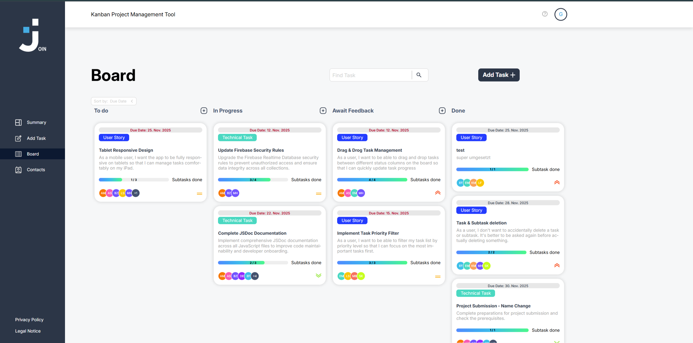

# Join - Kanban Project Management Tool



A collaborative task management application built with vanilla JavaScript, featuring drag-and-drop functionality, contact management, responsive layouts, and real-time data synchronization with Firebase.

## Features

- **Task Management**: Create, edit, search, delete, and organize tasks with priorities, due dates, categories, and subtasks
- **Kanban Board**: Drag-and-drop interface for managing task workflow across To Do, In Progress, Awaiting Feedback, and Done
- **Contact Management**: Add, edit, and delete contacts with profile images and contact details
- **User Authentication**: Login, sign-up, and guest access
- **Responsive Design**: Layouts optimized for desktop, tablet, and mobile devices
- **Real-time Sync**: Firebase Realtime Database integration for data persistence
- **Code Documentation**: JSDoc-based documentation for JavaScript modules

## Table of Contents

- [Installation](#installation)
- [Usage](#usage)
- [Project Structure](#project-structure)
- [Technologies](#technologies)
- [Feature Details](#feature-details)
- [Browser Compatibility](#browser-compatibility)
- [Code Documentation](#code-documentation)
- [Contributing](#contributing)
- [License](#license)
- [Authors](#authors)

## Installation

1. Clone the repository:

```bash
git clone https://github.com/yourusername/join.git
cd join
```

2. Install dependencies if you want to generate the documentation:

```bash
npm install
```

3. Open the project:

You can open `index.html` directly in your browser, or use a local development server:

```bash
# Using Python
python -m http.server 8000

# Using Node.js
npx serve
```

4. Navigate to `http://localhost:8000` or your server address.

A local server is recommended because some pages load HTML inserts dynamically.

## Usage

### Login

- Use the login form with your credentials
- Create a new account on the sign-up page
- Click "Guest Login" for immediate access without registration

### Dashboard (Summary)

- View task statistics and upcoming deadlines
- See a personalized greeting based on the time of day
- Check urgent tasks and overall workflow progress

### Board

- Drag and drop tasks between workflow columns
- Click tasks to view details or edit them
- Filter tasks by search term
- Add new tasks with the add button
- Move tasks on mobile with touch-optimized controls

### Add Task

- Fill in task details such as title, description, and due date
- Assign contacts to tasks
- Set priority: low, medium, or urgent
- Choose a category: User Story or Technical Task
- Add subtasks for detailed progress tracking

### Contacts

- View all contacts in alphabetical sections
- Add new contacts with profile colors and initials
- Edit existing contact information
- Delete contacts with confirmation
- Use the mobile-responsive contact details view

## Project Structure

```text
Project_Join/                              # Project root
├── .gitignore                             # Patterns for files and folders excluded from Git
├── README.md                              # Project overview, setup, and usage documentation
├── index.html                             # Entry point and login page
├── script.js                              # Global helper functions and initialization
├── style.css                              # Base CSS and global styles
├── jsdoc.json                             # JSDoc configuration
├── package.json                           # npm metadata and dependencies
├── package-lock.json                      # Locked npm dependency versions
├── data-backup.json                       # Sample or backup data
├── assets/                                # Static assets
│   ├── fonts/                             # Font files
│   └── img/                               # Logos, icons, and preview image
├── docs/                                  # Generated JSDoc documentation
├── pages/                                 # HTML pages and page inserts
│   ├── add-task-insert.html               # HTML insert for add-task components
│   ├── add-task.html                      # Page for creating tasks
│   ├── board.html                         # Kanban board page
│   ├── contacts.html                      # Contact overview and management page
│   ├── help.html                          # Help page
│   ├── legal-notice-external.html         # External legal notice variant
│   ├── legal-notice.html                  # Legal notice page
│   ├── privacy-policy-external.html       # External privacy policy variant
│   ├── privacy-policy.html                # Privacy policy page
│   ├── sign-up.html                       # Registration page
│   └── summary.html                       # Dashboard and statistics page
├── scripts/                               # JavaScript modules and page logic
│   ├── add-task-alert-overlay.js          # Overlay and alert logic for task creation
│   ├── add-task-create-task-form.js       # Task form creation helpers
│   ├── add-task-validation.js             # Add-task form validation
│   ├── add-task.js                        # Main add-task page logic
│   ├── authentication.js                  # Auth checks, session handling, and access control
│   ├── board-dom.js                       # Board DOM helpers
│   ├── board-helpers.js                   # General board helper functions
│   ├── board-tasks.js                     # Task rendering and task data logic
│   ├── board-ui.js                        # Board UI interactions
│   ├── board.js                           # Main Kanban board logic
│   ├── contactlist.js                     # Contact list rendering helpers
│   ├── contacts.js                        # Contact CRUD, display, and sorting
│   ├── db.js                              # Firebase Realtime Database interface
│   ├── dlg-add-task-subtask-handling.js   # Subtask handling in add-task dialogs
│   ├── dlg-contact-helper.js              # Contact dialog helper functions
│   ├── dlg-edit-task-assignment.js        # Assignment logic for edit-task dialogs
│   ├── dlg-edit-task.js                   # Task edit dialog logic
│   ├── dlg-task-info-helper.js            # Task info dialog helpers
│   ├── dlgs-contact.js                    # Contact dialog management and rendering
│   ├── drag-and-drop-autoscroll.js        # Auto-scroll behavior during drag and drop
│   ├── drag-and-drop-core.js              # Core drag-and-drop state and behavior
│   ├── drag-and-drop-mobile.js            # Mobile drag-and-drop interactions
│   ├── drag-and-drop-placeholders.js      # Placeholder rendering for drop targets
│   ├── drag-and-drop-pointer.js           # Pointer handling for drag interactions
│   ├── drag-and-drop.js                   # Drag-and-drop entry point
│   ├── generate-user-id.js                # User ID generation and management
│   ├── load-inserts.js                    # Dynamic loading of HTML inserts
│   ├── login.js                           # Login page logic
│   ├── mail-tld-validator.js              # Email TLD validation
│   ├── manage-user-profil.js              # User profile display and updates
│   ├── navigation.js                      # Responsive navigation and sidebar behavior
│   ├── search-task.js                     # Task search and filtering
│   ├── sign-up.js                         # Sign-up flow and validation
│   ├── summary.js                         # Dashboard statistics and greeting logic
│   └── task-card.js                       # Task card rendering and interaction
├── templates/                             # Client-side HTML templates
│   ├── tpl-add-task.js                    # Templates for add-task components
│   ├── tpl-board.js                       # Templates for board columns and placeholders
│   ├── tpl-contacts.js                    # Templates for contact lists and entries
│   ├── tpl-dialogs.js                     # Templates for modal dialogs and overlays
│   ├── tpl-login-sign-up.js               # Templates for login and sign-up forms
│   ├── tpl-navigation.js                  # Navigation and sidebar template
│   ├── tpl-task-card.js                   # Task card templates
│   └── tpl-user-profil-img.js             # User avatar template and SVG generator
└── styles/                                # CSS files separated by page and component
    ├── add-task.css                       # Add-task page and dialog styles
    ├── board.css                          # Kanban board styles
    ├── contacts.css                       # Contacts page styles
    ├── dlg-add-task.css                   # Add-task dialog styles
    ├── dlg-contact.css                    # Contact dialog styles
    ├── dlg-edit-task.css                  # Edit-task dialog styles
    ├── dlg-task-info.css                  # Task info dialog styles
    ├── external.css                       # Shared external page styles
    ├── header.css                         # Header and topbar styles
    ├── help.css                           # Help page styles
    ├── legal-notice.css                   # Legal notice page styles
    ├── login-signup.css                   # Login and sign-up styles
    ├── navigation.css                     # Navigation and sidebar styles
    ├── privacy-policy.css                 # Privacy policy page styles
    ├── sign-up.css                        # Sign-up page styles
    ├── summary.css                        # Dashboard styles
    └── task-card.css                      # Individual task card styles
```

## Technologies

- **Frontend**: HTML5, CSS3, Vanilla JavaScript (ES6+)
- **Database**: Firebase Realtime Database
- **Authentication**: Session Storage based authentication
- **Icons & Images**: SVG, PNG
- **Responsive Design**: CSS Media Queries, Flexbox, Grid
- **Documentation**: JSDoc

## Feature Details

### Task Management

- **Priority Levels**: Low, medium, and urgent
- **Categories**: User Story and Technical Task
- **Subtasks**: Checkbox tracking for task breakdown
- **Due Dates**: Calendar picker with validation
- **Search & Filter**: Real-time task filtering on the board
- **Task Dialogs**: Detailed task view and edit workflow

### Contact Management

- **Profile Images**: Auto-generated colored circles with initials
- **Contact Details**: Name, email, and phone number
- **Alphabetical Grouping**: Organized by first letter
- **Current User Indicator**: "(You)" tag for the logged-in user
- **Task Assignment**: Contacts can be assigned to tasks

### Responsive Design

- **Desktop**: Sidebar navigation and split-view layouts
- **Tablet**: Optimized spacing and touch targets
- **Mobile**: Compact navigation, mobile dialogs, and touch-friendly controls

### Drag and Drop

- **Visual Feedback**: Placeholder indicators during drag
- **Column Highlighting**: Drop zones highlight on hover
- **Touch Support**: Mobile-friendly drag implementation
- **Auto-scroll**: Board can scroll while dragging near viewport edges
- **Click Prevention**: Smart detection prevents accidental task opens after dropping

## Browser Compatibility

- Chrome (recommended)
- Firefox
- Safari
- Edge
- Mobile browsers

## Code Documentation

The project uses JSDoc for comprehensive code documentation:

- Functions include parameter and return type documentation
- Event listeners are documented with `@listens` tags where applicable
- Async functions are marked with `@async`
- Complex objects include property documentation

Generate HTML documentation:

```bash
npx jsdoc -c jsdoc.json
```

## Contributing

1. Fork the repository
2. Create a feature branch (`git checkout -b feature/AmazingFeature`)
3. Commit your changes (`git commit -m 'Add some AmazingFeature'`)
4. Push to the branch (`git push origin feature/AmazingFeature`)
5. Open a Pull Request

### Code Style Guidelines

- Use JSDoc comments for functions
- Follow existing naming conventions: camelCase for functions and variables
- Use `const` by default, and `let` only when reassignment is needed
- Keep functions focused and readable
- Use semantic HTML and clear CSS class naming
- Keep CSS organized by page and component

## License

This project is part of the Developer Akademie curriculum.

## Authors

- Join Team 1331 - Developer Akademie

## Acknowledgments

- Firebase for backend infrastructure
- Developer Akademie for project guidance
- All contributors and testers

---

**Note**: This is an educational project created as part of the Developer Akademie full-stack web development course.
